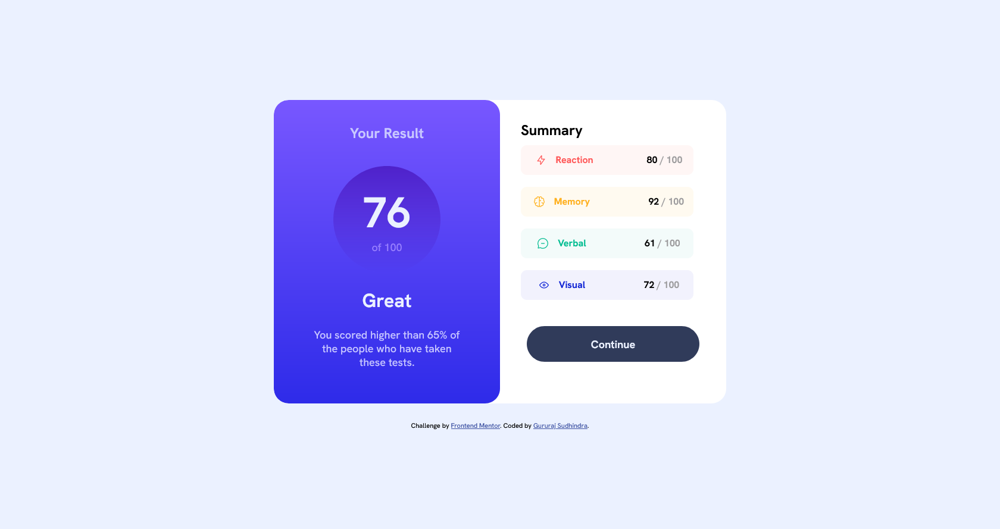

# Frontend Mentor - Results summary component solution

This is a solution to the [Results summary component challenge on Frontend Mentor](https://www.frontendmentor.io/challenges/results-summary-component-CE_K6s0maV). Frontend Mentor challenges help you improve your coding skills by building realistic projects.

## Table of contents

- [Overview](#overview)

- [The challenge](#the-challenge)

- [Screenshot](#screenshot)

- [Links](#links)

- [My process](#my-process)

- [Built with](#built-with)

- [Useful resources](#useful-resources)

- [Author](#author)

## Overview

### The challenge

Users should be able to:

- View the optimal layout for the app depending on their device's screen size

- See hover states for all interactive elements on the page

- Calculate the correct tip and total cost of the bill per person

### Screenshot

### Links

- Solution URL: [Solution](https://github.com/SG75/result-summary-component)

- Live Site URL: [Live Site](https://your-live-site-url.com)

## My process

### Built with

- Semantic HTML5 markup

- CSS custom properties

- Flexbox

### Useful resources

I often used MS paint, Chrome Devtools and <a href="https://htmlcolors.com/hex-to-hsl" target="__blank">hex to hsl converter</a>
I use "Pixel Perfect Pro" addon for chrome to match the design with my code

## Author

- Frontend Mentor - [@sg75](https://www.frontendmentor.io/profile/sg75)
